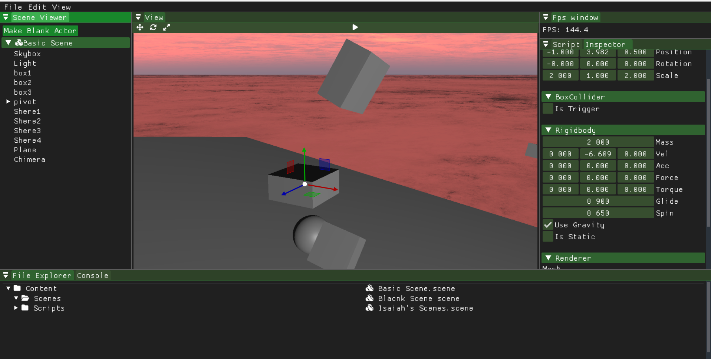

# Isaiah Dickison Portfolio
## Hostile Engine
3D custom game engine using ECS architecture that I am the lead tools programmer on.  
Github link: https://github.com/Environmental-Corporate-Solutions/Hostile-Engine

## Dapper Engine
This is a c++ custom game engine that I arcityped and made with 4 other classmates for a scool project.

## Rushing Tide
A water exploration game made in the dapper engine made with a 14 person multidiciplne team including engenners, artist, game designers, and music designers

## Procedural terrain editor
A unity project with a custom tool to create, texure, and add efects to a 3d terrain object in unity

## Home Implosion 
A school game project that I am currently working on in ureal 5 with a team of 16 people.